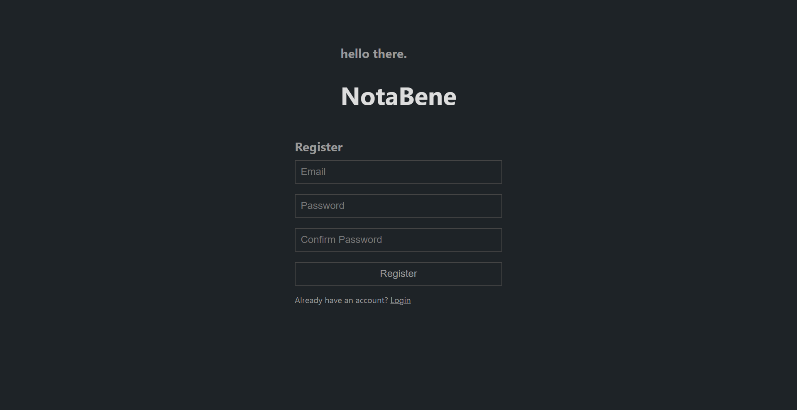
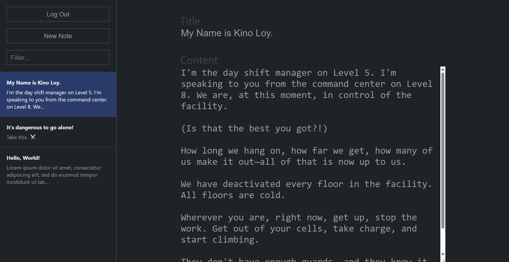

# NotaBene

NotaBene is a full-stack notes application inspired by
[Simplenote](https://simplenote.com/). NotaBene is built on a C#/ASP.NET Core
REST API backend and TypeScript/Angular SPA frontend.





## Tech Stack

- **Frontend:** TypeScript/Angular SPA (built and served as static files)
- **Backend:** C#/.NET 8 ASP.NET Core REST API (serves both the API endpoints
  and static files)
- **Database:** Entity Framework Core with SQL Server Express development and
  testing locally and in CI; Azure SQL Database in production
- **Hosting:** Azure App Service (Linux)

## CI/CD Pipeline

### 1. Continuous Integration (CI) - `.github/workflows/ci.yml`

**Triggers:** Pull requests and direct pushes to main branch

- Set up SQL Server container and database migrations for testing
- Run Playwright API tests

### 2. Continuous Deployment (CD) - `.github/workflows/cd.yml`

**Triggers:** After successful CI on main branch (or manual trigger)

**Build**

1. Generate Angular build (static files) into `api/wwwroot`
2. Generate .NET production build into `api/publish`

**Deployment**

1. Run migrations to update Azure SQL database schema
2. Deploy app to Azure App Service

## Key Configuration

### GitHub Secrets

- `AZURE_WEBAPP_PUBLISH_PROFILE`: Azure deployment credentials
- `AZURE_SQL_CONNECTION_STRING`: Database connection
- `SA_PASSWORD`: CI database password

### Azure Resource Components

- Resource Group
  - SQL Server
    - SQL Database
  - App Service

### File Structure

```
root/
├── .github/workflows/
│   ├── ci.yml              # Tests on PR
│   └── cd.yml              # Deploy on main
├── api/                    # .NET API
│   ├── wwwroot/            # Angular build output
│   └── Program.cs          # Serves static files + API
├── client/                 # Angular app
└── tests/                  # Playwright
```
